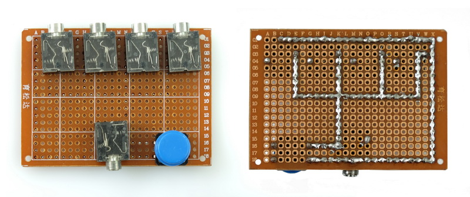
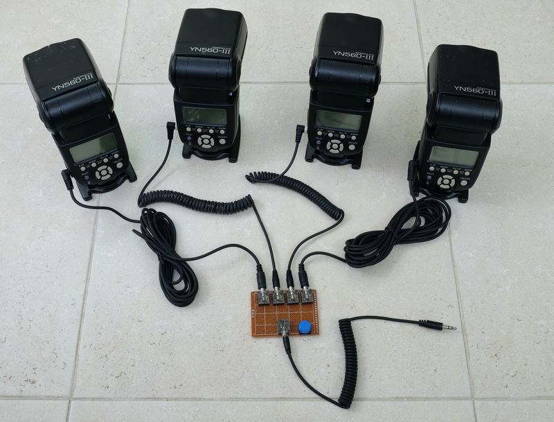
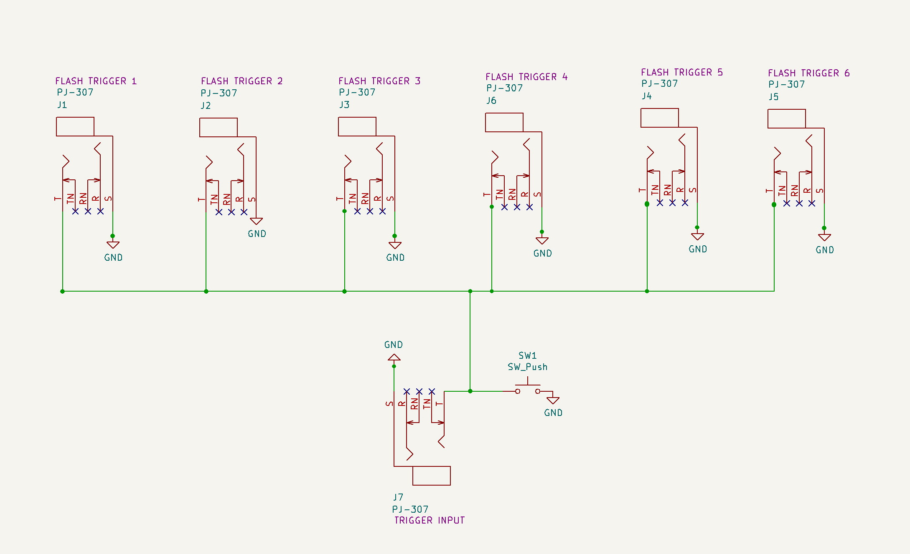
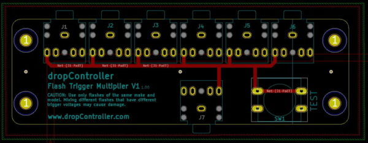
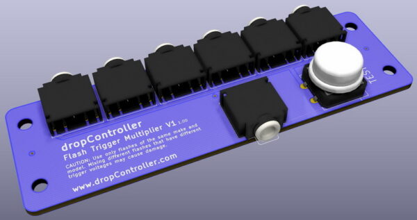

# Flash_Trigger_Multiplier
Simple trigger multiplier using 3,5mm sockets

I originally built a 1 in 4 out flash trigger multiplier using a small perf board. Later, I exyended it to 1 in 6 out and created a proper PCB.
The circuit joins all the flashes together and should only be used with flash guns of the same model or when they all have the same trigger voltage.

 
 

## Perfboard
Works with 1 to 4 flash guns. 

 
 

## PCB
Works with 1 to 6 flash guns.

### download KiCAD Files

[Download PCB files](assets/dropController_FlashExtender_v1.00_PCB.zip)  

 
 

 
 

